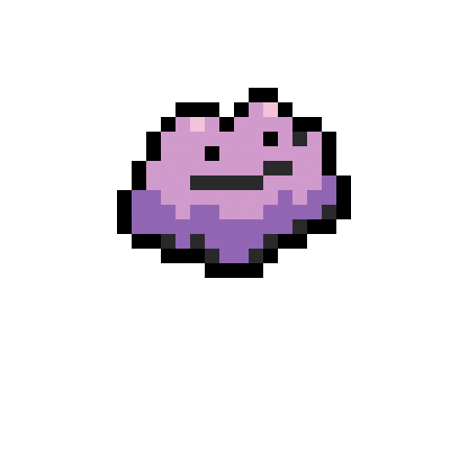

# PixelPet 🐾

> 像拼豆一样画画，画完它就活过来陪你。

在方格纸上点几下颜色，你的像素画就会变成一个会跳、会眨眼、会跑动的 macOS 桌面小伙伴。



## 下载

**[⬇️ 下载最新版本](https://github.com/Ziyi-ZHU-1027/PixelPet/releases/latest)**

或访问下载页：[ziyi-zhu-1027.github.io/PixelPet](https://ziyi-zhu-1027.github.io/PixelPet/)

> macOS 13 Ventura 及以上。首次打开请右键 → 打开（绕过 Gatekeeper）。

---

## 功能

| 功能 | 说明 |
|------|------|
| 🎨 像素画板 | 15×15 / 25×25 / 32×32 三档尺寸，拼豆色板（A-M 系列 199 色）+ 自由调色 |
| 👀 眨眼动画 | 画一张"眨眼帧"，宠物会自动每隔几秒眨一次眼 |
| 🐾 随机跑动 | 右键开启，宠物跳跳跳地在屏幕上游走 |
| 💕 互动反应 | 单击跳跃，双击冒爱心，可拖拽移动 |
| 🐣 多只同时 | 做好的宠物保存在列表里，随时召唤多只同时在桌面 |
| 🔄 自动更新 | 内置 Sparkle，有新版本时自动提示 |

---

## 截图

<table>
<tr>
<td><b>画板编辑器</b><br>拼豆色板 + 历史颜色</td>
<td><b>桌面宠物</b><br>浮在桌面，单击跳跃</td>
</tr>
</table>

---

## 技术栈

- **语言**：Swift 5.9+
- **UI**：SwiftUI + AppKit（透明 NSPanel 浮窗）
- **架构**：Swift Package Manager，单进程多窗口
- **自动更新**：[Sparkle 2.x](https://sparkle-project.org)
- **平台**：macOS 13+

### 项目结构

```
Sources/
├── PixelPetKit/          # 共享库
│   ├── Model/            # PixelCanvas、PetDefinition、PetStore、PetAnimator
│   ├── View/             # EditorView、PixelGridView、RightPanelView 等
│   └── Window/           # PetWindow、PetWindowController、PetHostManager
└── PixelPetApp/          # App 入口
Tests/
└── PixelPetKitTests/     # PixelCanvas、PetStore 单元测试
```

---

## 本地构建

```bash
# 克隆
git clone https://github.com/Ziyi-ZHU-1027/PixelPet.git
cd PixelPet

# 运行（开发模式）
swift run PixelPetApp

# 打包成 .app
bash build.sh
open PixelPet.app
```

**依赖**：Xcode Command Line Tools、macOS 13+

---

## 发版

```bash
# 1. 改 build.sh 里的 VERSION
# 2. 运行发版脚本（自动 build、打 zip、签名、生成 appcast）
bash release.sh

# 3. 在 GitHub 创建 Release，上传生成的 zip
# 4. 推送 appcast.xml
git add docs/appcast.xml && git commit -m "release: vX.Y.Z" && git push
```

详见 [docs/RELEASE_SOP.md](docs/RELEASE_SOP.md)。

---

## 贡献

欢迎提 Issue 和 PR！如果你画了好看的像素宠物，也欢迎分享 🎨

⭐ 如果喜欢这个项目，给个 Star 是对我最大的鼓励！

---

## License

MIT
